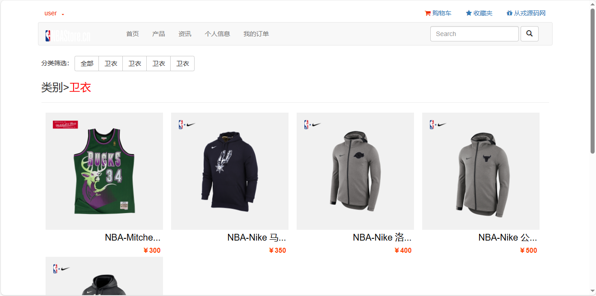

<h1 align="center">49.基于ssm的NBA网商平台管理系统</h1>

###  获取sql数据库文件: 从戎源码网 (https://armycodes.com/) QQ: 386869957 QQ群: 377586148 
###  所有系统地址: (https://github.com/YuLin-Coder/AllProjectCatalog) 微信: yulin-coder
###  所有项目以及源代码本人均调试运行无问题 可支持远程安装部署调试、定制修改、代码讲解

## 简介
> 本代码来源于网络,仅供学习参考使用!

> 前端访问: http://localhost:8080/
> 
> 用户：user 1
> 
> 后台访问: http://localhost:8080/admin/login
> 
> 管理员：admin 1
>

## 项目介绍
基于ssm的NBA网商平台管理系统：前端jsp、jquery、bootstrap，后端 spring、mybatis，集成商品管理、订单管理、资讯管理、商品前台展示、商品详情、分类展示、购物车等功能于一体的系统。

## 功能介绍

### 用户

- 基本功能：登录、注册、退出
- 首页：广告轮播图、分栏展示、全部商品列表展示、全局搜索、顶部导航
- 产品：分类筛选、收藏操作、收藏夹列表、收藏取消、商品详情、商品评价、加入购物车、购物车列表、确认订单、在线结算
- 我的订单：未发货订单、未收货订单、已完成订单
- 个人信息：个人信息查看、个人信息修改、添加收货地址、修改收货地址、删除收货地址
- 资讯：分类展示资讯、资讯详情

### 管理员

- 商品管理：所有商品列表、添加商品、添加分类、分类列表、分类编辑、分类删除、商品详情、商品编辑、商品删除
- 用户管理：用户列表、用户删除、用户密码重置
- 订单管理：订单列表、未发货、未收货、已完成、发货操作
- 资讯管理：资讯列表、资讯编辑、资讯删除、资讯详情、添加资讯

## 环境

- <b>IntelliJ IDEA 2009.3</b>

- <b>Mysql 5.7.26</b>

- <b>Tomcat 7.0.73</b>

- <b>JDK 1.8</b>

## 运行截图

